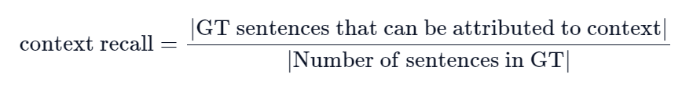

## SECTION 1 : PROJECT TITLE
## LearnSphere Navigator - A Courseware Intelligent Assistant System

---
## SECTION 2: EXECUTIVE SUMMARY
The Courseware Intelligent Assistant System (CIAS) is designed to revolutionize the way students learn and review course materials. By incorporating advanced Optical Character Recognition (OCR) technology, CIAS can transform paper-based course materials and other non-digital resources into editable digital documents, creating a convenient platform for students. The intelligent agent feature of the system utilizes the content of the courseware and a comprehensive knowledge base to provide real-time answers to students' questions and offer personalized learning guidance. Additionally, the learning and review system generates customized review materials based on the students' learning history, helping them consolidate knowledge more effectively and enhance their learning efficiency.

Students face numerous challenges during their learning process, which can hinder their progress, reduce their efficiency, and even affect their interest in learning. Faced with vast course content and a plethora of learning materials, students often do not know where to start. A lack of clear learning paths can leave them feeling confused and helpless. The diversity and dispersion of course materials, coming from different sources such as classroom notes, textbooks, and online resources, can make it difficult for students to quickly find the information they need when they need it. Overwhelmed by the sheer volume of materials and unsure of where to begin, students may spend a lot of time on their studies but achieve less than desired results. This can lead to low learning efficiency and even a vicious cycle of poor performance. Additionally, students may find it challenging to identify key points during review sessions. Without effective revision strategies, they may perform poorly on exams and tests.

Moreover, students often need to adjust their study methods based on their own progress and requirements during the review phase. However, traditional learning methods often fail to provide personalized guidance, making it difficult for students to find the most suitable learning path for themselves. When students waste time due to these reasons, their learning progress is affected, which may prevent them from mastering the course content within the allotted time. This can also lead to stress and even anxiety. Such psychological burdens can further hinder their learning progress. Facing such continuous learning difficulties, their motivation might gradually decrease, and they might even develop an aversion to learning.

These issues indicate that students face a variety of challenges during their learning process, involving aspects such as learning direction, material management, knowledge understanding, efficiency, review, and psychological pressure. Addressing these issues is key to enhancing student learning outcomes and reducing learning barriers.

The digitization and organization of course materials are highly repetitive and prone to errors. If there are hundreds of course materials in a semester, this means that students need to spend a lot of time handling them. The design of the Courseware Intelligent Assistant System aims to solve these problems by automating processes to increase efficiency, reduce errors, and ensure data consistency. This automation can significantly reduce the time costs for students while improving the quality of courseware organization and management. The main advantages include:

- Fewer manual errors: By reducing manual handling, the system lowers the risk of errors due to human operations.
- Consistency of courseware content: The system ensures that all digitized materials have a uniform format, which facilitates subsequent processing and use.
- Significant time savings: With automated processes, the time saved allows students to invest their energy in more important learning and research work.

By implementing this automated process, the Courseware Intelligent Assistant System provides students with a more efficient and reliable method of managing resources, ensuring that they can access and utilize learning resources more conveniently.

---

## SECTION 3 : CREDITS / PROJECT CONTRIBUTION

| Official Full Name  | Student ID (MTech Applicable)  | Work Items (Who Did What) | Email (Optional) |
| :------------ |:---------------:| :-----| :-----|
|Huang Qichen|A0285822X|contribution|e1221634@u.nus.edu|
|WEICHUANJIE|A0285709N|contribution|e1221521@u.nus.edu|
|Yan Zihan|A0285706W|contribution|e1221518@u.nus.edu|

---
## SECTION 4 : VIDEO OF SYSTEM MODELLING & USE CASE DEMO

---

## SECTION 5 : USER GUIDE

`Refer to FILE`

### 1.1 Install Dependencies

Run the pip install Command:
`pip install -r requirements.txt`

### 1.2 Add your API key

Add your API key into system environment:
`setx OPENAI_API_KEY "your_openai_api_key"`

### 1.3 Starting the Web Application

Run:
`streamlit run '.\Study mode.py'`

---
## SECTION 6 : PROJECT REPORT / PAPER

`Refer to project report at Github Folder: ProjectReport`

---

## SECTION 7: Further Exploration

- A broad view of RAG: [arxiv](https://arxiv.org/pdf/2402.19473)
- A broad view of Agent: [arxiv](https://arxiv.org/abs/2309.07864)

### 7.1 RAG

#### 7.1.1 Foundations

1. Query-based RAG
    - Query-based RAG seamlessly integrates the user’s query with insights from retrieved information, feeding it directly into the initial stage of the language model’s input. This is the most common method.

2. Latent Representation-based RAG

3. Logit-based RAG

4. Speculative RAG

#### 7.1.2 Pipeline and Enhancements (Methods)

1. Input Enhancement:
    - Query Transformation:
        - HyDE method: Use the original query to generate a pseudo document, which is later used as the query for retrieval.
    - Query Rewrite: Generate additional questions (with LLM) based on the primary query to obtain a more precise retrieved result.

2. Retriever Enhancement:
    - Knowledge Graph Retrieval: RAG with KG for Customer Service Question Answering [Arxiv](https://arxiv.org/abs/2404.17723) 
    - Hybrid Retrieval:
        - Hybrid retrieval denotes the concurrent employment of a diverse array of retrieval methodologies or the extraction of information from multiple distinct sources (Dense Retriever and Sparse Retriever).
        - C-RAG: CRAG features a retrieval evaluator that gauges document relevance to queries, prompting three retrieval responses based on confidence: direct use of results for Knowledge Refinement if accurate, Web Search if incorrect, and a hybrid approach for ambiguous cases. Related Article: [CSDN Blog](https://blog.csdn.net/L_goodboy/article/details/137581551)
    - Chunk Optimization:
        1. Lapping Chunk
        2. RAPTOR employs recursive embedding, clustering, and summarization of text chunks until further clustering becomes infeasible, thereby constructing a multi-level tree structure.
        3. Chunk by Segment.
    - Reranking: Rerank the retrieved contents (from multiple retrievers).

#### 7.1.3

#### 7.1.4 Evaluation

1. Retrieval-Augmented Generation Benchmark
   - [Arxiv](https://arxiv.org/pdf/2309.01431)
   - [Github](https://github.com/chen700564/RGB)
   - [Related reference](https://blog.csdn.net/m0_46850835/article/details/136377919)

2. RAGAs: (Retrieval Augmented Generation Assessment)
   - [RAGAS: Automated Evaluation of RAG](https://arxiv.org/pdf/2309.15217)
   - [RAGAS application](https://segmentfault.com/a/1190000044806908)
   - [Github](https://github.com/explodinggradients/ragas)
   - [使用教程](https://github.com/explodinggradients/ragas/blob/main/docs/howtos/integrations/llamaindex.ipynb)

   2.1 Main aspects:
   - retriever: 
     - Context_precision: (85%)  Measures how relevant the retrieved context is to the question, conveying the quality of the retrieval pipeline
     - 大概就是看高相关度 context 是否在靠前的位置被召回
     - 
     - Context_recall: Measures the retriever’s ability to retrieve all necessary information required to answer the question. It is computed based on the ground truth and the retrieved context.
     - 为了从基本真实答案中估算上下文召回率，需要对ground truth中的每个句子进行分析，以确定其是否可归因于检索到的上下文。在理想情况下，ground truth中的所有句子都应归属于检索到的上下文。
     - 
   - Generator(LLM): 
     - Faithfulness: Evaluate hallucinations, measures the factual consistency of the answer to the context based on the question. That is, whether the answer matches the retrieved context.
     - 如果答案中的所有主张都可以从给定的上下文中推断出来，那么生成的答案就被认为是忠实的
     - 

     - Answer relevancy: Measure how relevant the answers are to the questions, (origin Q) & (Generated Q from origina A) cos-similarity based on embedding
     - 答案相关性被定义为原始问题与大量人工问题的平均余弦相似度，而人工问题是根据答案生成的（逆向工程）。

3. llamaindex

4. Traditional Information retrieved evaluation
   - Hit Rate:
     - Hit rate calculates the fraction of queries where the correct answer is found within the top-k retrieved documents. In simpler terms, it’s about how often our system gets it right within the top few guesses.
     - 
   - NDCG:
     - NDCG is a metric that evaluates the ranking of retrieved documents. It is calculated by dividing the DCG score of the correct answer by the DCG
     - 
   - Mean Reciprocal Rank (MRR):
     - For each query, MRR evaluates the system’s accuracy by looking at the rank of the highest-placed relevant document. Specifically, it’s the average of the reciprocals of these ranks across all the queries.
     - 
   - Mean Average Precision (MAP):
     - 
---
Check out the configuration reference at https://huggingface.co/docs/hub/spaces-config-reference
